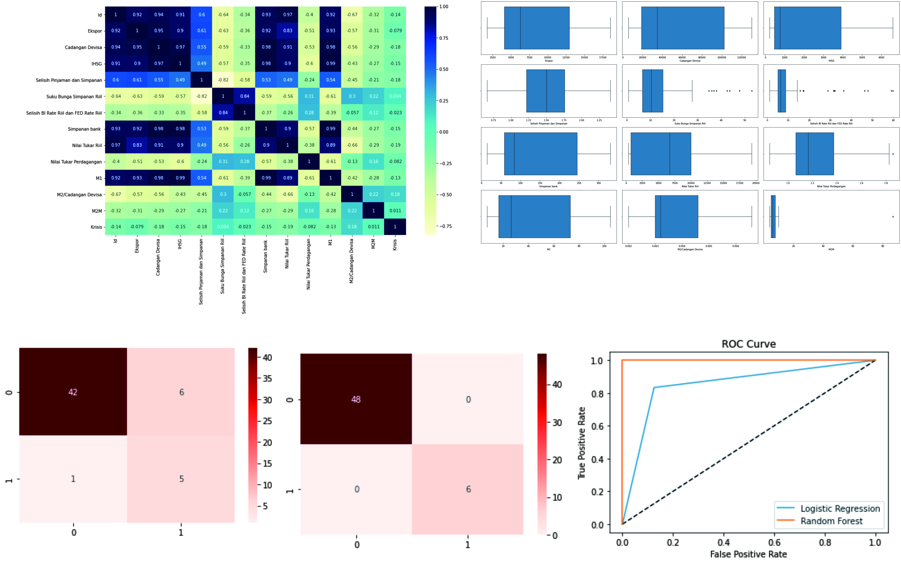

# Indonesia-Financial-Crisis

## Project Overview

The project to determine whether or not the company experiencing a crisis based on its important features. 
I am performing comprehensive EDA on Indonesia’s financial crisis dataset to understand important variables,
outliers, and apply machine learning models to predict new data to find out which data are in crisis. The 
best model for this project is the random forest using ROC/AUC as evaluation matrix.
  

## Framework Steps:

1. Data Preparation
2. Data Cleaning
3. EDA
4. Feature Engineering & Feature Scaling
5. Modeling
6. Evaluation
7. Deployment

## Result
Using 2 models, this are the results of the evaluation of the matrix:

| Model               | Precision | Recall | F1-Score | Accuracy | ROC/AUC |
|---------------------|-----------|--------|----------|----------|---------|
| Logistic Regression | 0.45      | 0.83   | 0.59     | 0.87     | 0.85    |
| Random Forest       | 1.00      | 1.00   | 1.00     | 1.00     | 1.00    |

